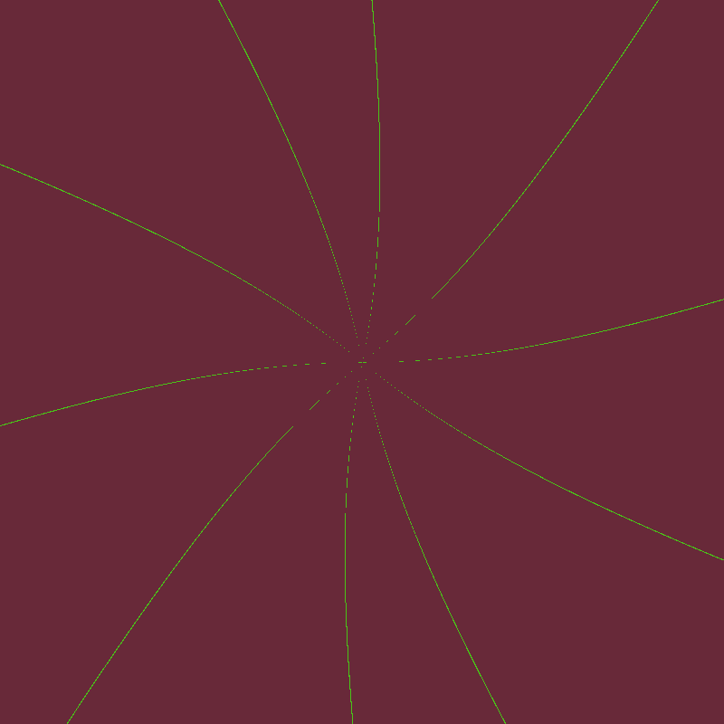
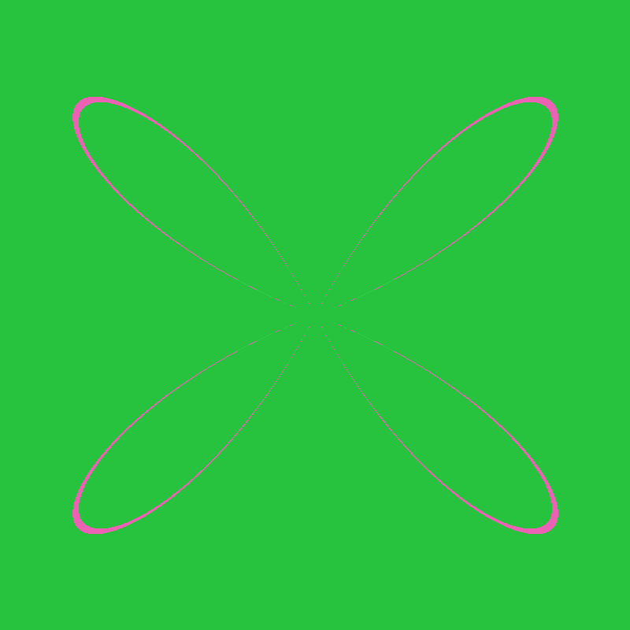
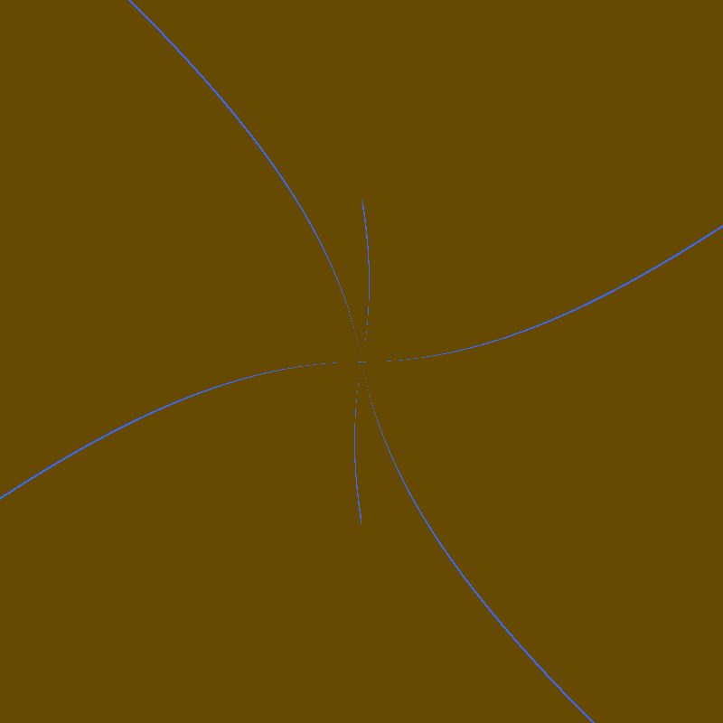
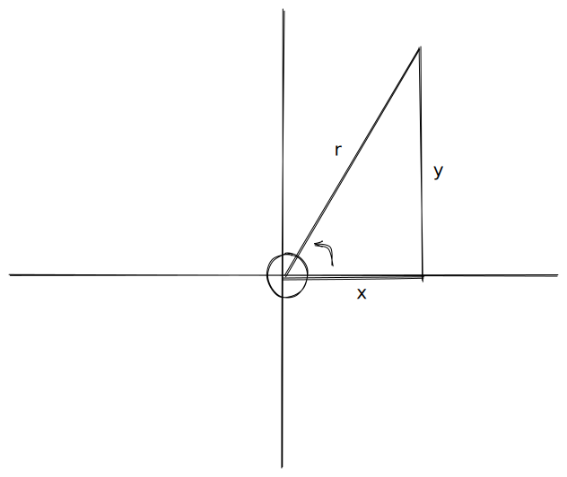

# Mirage 

A simple CLI application to do some image processing tasks

## Building

Clone the repository using
```shell
git clone https://github.com/JosiasAurel/mirage.git
```
Now go to the project root
```shell
cd mirage
```
Install packages with `cargo build`.

Create a release build with `cargo build --release`.

You should then have a binary called `mirage` in `/target/release`.
Run the binary by calling it `./mirage`.

## Features

### Blur Image

You can blur images by running
```shell
./mirage input.png output.png 
```
The default blur amount is 2.0 but you can change that to any amout you want by passing a number as third argument.

```shell
./mirage input.png output.png 3.4
```

### Grayscale Image

Make an image grayscale by running
```shell
./mirage grayscale input.png output.png
```

### Invert Image
Invert an image using
```
./mirage invert input.png output.png 
```

### Rotate Image 
You can rotate an image `left` or `right` or make it `reverse`.
```
./mirage rotate input.png output.png left|right|reverse
```

### Brighten Image

This will brighten the image by an amout of 2
```shell
./mirage brighten input.png output.png 
```
Set your own brightness by passing a number as third argument. It should be an integer. 
Negative values will make the image dimmer while positive values will make it brighter.
```shell
./mirage brighten input.png output.png 4
```

### Crop Image

Run
```shell
./mirage crop input.png output.png x y width height
```
Where x and y represent the initial points where to crop while width is how much to move on the x-axis and height is how much it moves from the y-axis.
These arguments are required.

### Fractal Image

The CLI will generate a Julia set fractal if you run
```shell
./mirage fractal outfile.png
```

### Generated Image

The CLI can also generate random beautiful patterns if you're lucky.
```shell
./mirage generate outfile.png
```

Some sample patterns below





## How Generating Patterns work

Polar Coordinates 👩‍🎤 ... no, there are no polar bears.

I'll save you some brain cells and direct your to [Brillian](https://brilliant.org/wiki/polar-curves/) if you want to understand them.

> I will assume you have gone through the article and have an understanding on how to plot polar curves 

Generally polar coordinates are of the form $r = acos\theta$. The trigonometric function there could be any of $cos$, $sin$ or $tan$ or even more than one.

We know that 

$$ r² = x² + y² ...1 \\ x = rcos\theta ...2 \\ y = rsin\theta ...3
$$

Note : If you are unsure about x and y, think of Pythagorean theorem.



This alone proves our first equation.
In polar coordinates, points are of the form $(r, \theta)$ but we are dealing with cartesian coordinates $(x, y)$.

In order to plot each polar point,we need to first convert them to cartesian points.

$$ sin\theta = { y \over r } \\ cos\theta = { x \over r } \\ tan\theta = { y \over x } $$

For $tan\theta$, we will get the value of $\theta$ in the polar point.

If you take a look at the code, I could easily loop within a range of values, get the (x, y) values and drop them on the image. But that means we might have to do two loops.
- One for plotting the polar points (converted to cartesian points)
- Another to light all the other pixels

That's double work... we don't want O(N²)

So a simpler method would be to just iterate over the pixels of the image and light the ones that fall on the polar curve with a special color to differentiate them.

Okay? How do we do that?

Glad you asked!

First we know we can get the value of $\theta$ from the (x, y) point. 
Now to get r, we can use any of equation 2 or 3 above - both should work.

We can simple substitute $\theta$ we got from the (x, y) coordinate in the equation of the curve.
If for that value of $\theta$ we get the same value of r as those from we got from the (x, y) point, then this cartesian point lies on the curve and we can light it with our special color.

This same operation is repeated for each (x, y) value of the image until we are done. The final output is a beautiful pattern.

## TODO
- Make commands stackable
- Write proper README

Contributions & Improvements are welcome.

